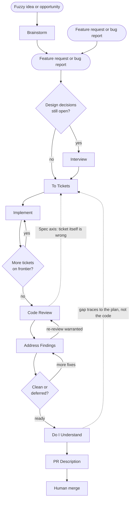

# rt-skills

Agent skills that run a full feature/bugfix cycle — from a fuzzy idea or an incoming request through a merge-ready PR.

## Flow

Work can enter two ways: as a **fuzzy idea or opportunity** with no request yet, or as an already-formed **feature request** or **bug report**.

- If it's fuzzy, use **rt-brainstorm** — it optionally grounds the problem in competitor/user/market evidence, then generates and discusses candidate directions until one is chosen.
- Once a request exists, use **rt-interview** when design decisions are still open; otherwise go straight to **rt-to-tickets**.



Two escape hatches shown as dotted lines: if **rt-code-review**'s Spec axis or **rt-do-i-understand**'s interrogation finds that the *ticket* was wrong rather than the implementation, don't force a code fix onto a bad plan — go back to **rt-to-tickets** (or **rt-interview** first, if a design decision needs renegotiating).

| Step | Skill                                                        | Purpose                                                                                          |
| ---- | ------------------------------------------------------------- | -------------------------------------------------------------------------------------------------------------------------------------------------------------------------------------------- |
| —    | —                                                             | **Start:** fuzzy idea/opportunity, or a feature request/bug report                                                                             |
| 0    | [rt-brainstorm](.agents/skills/rt-brainstorm/SKILL.md)              | Optionally gather competitor/user evidence, generate and discuss candidate directions, converge on one _(skip if a request already exists)_    |
| 1    | [rt-interview](.agents/skills/rt-interview/SKILL.md)                | Stress-test the plan; resolve design decisions with the user _(skip if scope is already clear)_                                                |
| 2    | [rt-to-tickets](.agents/skills/rt-to-tickets/SKILL.md)               | Break the plan into tracer-bullet vertical slices with blocking edges                                                                          |
| 3    | [rt-implement](.agents/skills/rt-implement/SKILL.md)                 | Ship one ticket end-to-end; work the frontier until all tickets are done                                                                       |
| 4    | [rt-code-review](.agents/skills/rt-code-review/SKILL.md)             | Two-axis review: Standards + Spec                                                                                                               |
| 5    | [rt-address-findings](.agents/skills/rt-address-findings/SKILL.md)   | Fix review findings or consciously defer with rationale                                                                                        |
| 6    | [rt-do-i-understand](.agents/skills/rt-do-i-understand/SKILL.md)     | Reverse review — attests the author understands what they're shipping                                                                          |
| 7    | [rt-pr-description](.agents/skills/rt-pr-description/SKILL.md)       | Write the PR title/body; open or update the PR                                                                                                 |

Skills live under `.agents/skills/` (each named with an `rt-` prefix). Tickets land in `.agents/tickets/`.

## What this replaces vs what it doesn't

**Covered:** problem exploration, evidence gathering, planning, decomposition, implementation, self-review, review-fix loop, author accountability, PR packaging.

**Still human (by design):**

- **Merge** — final accountability gate
- **Product prioritization** — which feature to build next. **rt-brainstorm** widens and grounds the option set; it never picks a winner. That choice stays with the user.
- **Production incident response** — on-call judgement under fire
- **Org/process** — hiring, estimates, stakeholder politics

**Optional additions** if you want to go further:

| Gap                            | Skill to add                | When you need it                                                                        |
| ------------------------------- | ---------------------------- | ----------------------------------------------------------------------------------------- |
| Bug intake without a plan       | `rt-triage`                  | User reports "it's broken" with no repro — lightweight interview before **rt-to-tickets** |
| Stack of PRs from one feature   | `split-to-prs`               | Built-in Cursor skill — large changes that shouldn't be one PR                            |
| Post-merge monitoring           | `rt-verify-deploy`           | You ship to prod and need smoke checks / rollback criteria                                |
| Recording architectural choices | `rt-adr`                     | An **rt-interview** resolves a genuinely architectural decision worth writing down         |
| User-facing release notes       | `rt-changelog`               | You want a changelog entry generated from the merged PR description                       |
| Pre-build risk flagging         | `rt-risk-assessment`         | The feature touches auth/money/PII and you want risks named before implementation starts  |
| Repo-wide standards doc         | `STANDARDS.md` in repo root  | **rt-code-review** Standards axis works better with documented conventions                |

## Quick start

1. Bring a **fuzzy idea** — or skip straight to step 3 if you already have a **feature request** or **bug report**
2. `@rt-brainstorm` — optionally pull in competitor/user evidence, explore directions, converge on one _(skip once a concrete request exists)_
3. `@rt-interview` — only if design decisions are still open
4. `@rt-to-tickets` — publish tickets to `.agents/tickets/`
5. `@rt-implement` — pick the frontier ticket; repeat until done
6. `@rt-code-review` since `main`
7. `@rt-address-findings`
8. `@rt-do-i-understand`
9. `@rt-pr-description`

## Examples

### Example: shape a fuzzy idea before it's a request

**Starting point:** "Our checkout conversion has been flat for two quarters. Something's off but I don't know what to build."

No request exists yet — this is exactly what **rt-brainstorm** is for.

| Step          | What you say                                                                | What happens                                                                                                                                                                                                |
| ------------- | ---------------------------------------------------------------------------- | ------------------------------------------------------------------------------------------------------------------------------------------------------------------------------------------------------- |
| `@rt-brainstorm` | "What are competitors doing at checkout, and what do support tickets say — then help me figure out what to build" | Agent gathers evidence first (competitor checkout flows, support-ticket themes, sourced, no conclusions drawn yet), then proposes 3–5 distinct directions grounded in that evidence (e.g. guest checkout, saved-payment friction, rate-limit-driven errors, cart-abandonment email), discusses each one at a time |
| _(converge)_  | "Let's go with reducing saved-payment friction"                              | Agent writes a short direction brief — problem, evidence, chosen direction, directions set aside, open questions — no acceptance criteria yet                                                              |
| `@rt-interview`  | _(no extra prompt)_                                                           | Open questions from the brief (which payment methods, how much re-auth to skip) get resolved one at a time                                                                                                 |
| `@rt-to-tickets` | "Break this into tracer bullets"                                              | Normal flow continues as usual                                                                                                                                                                              |

---

### Example: implement a feature

**Request:** "Add rate-limit headers to the checkout API so clients know when they're throttled."

Design is open — you don't yet know the limit, window, or response shape. Run the full planning path.

| Step                | What you say                           | What happens                                                                                                                                                                              |
| ------------------- | --------------------------------------- | ------------------------------------------------------------------------------------------------------------------------------------------------------------------------------------------------------- |
| Start               | Paste the request into chat            | Work enters the flow                                                                                                                                                                      |
| `@rt-interview`        | _(no extra prompt — the skill drives)_ | Agent asks one design question at a time: limit per IP or per user? fixed window or sliding? return `Retry-After`? You answer; repeats until you confirm shared understanding             |
| `@rt-to-tickets`       | "Break this into tracer bullets"       | Agent explores the codebase, drafts vertical slices (e.g. middleware → 429 response → client header parsing), shows blocking edges, iterates until you approve, writes `.agents/tickets/` |
| `@rt-implement`        | "Work the frontier ticket"             | Agent picks the unblocked ticket, implements schema/API/tests for that slice, runs targeted then full tests, checks off acceptance criteria, repeats until all tickets are done           |
| `@rt-code-review`      | `since main`                           | Two-axis review: Standards (repo conventions + smell baseline) and Spec (matches tickets)                                                                                                 |
| `@rt-address-findings` | _(if review found issues)_             | Fixes must/should items, re-runs tests, defers anything out of scope with rationale                                                                                                       |
| `@rt-do-i-understand`  | _(with branch diff in context)_        | Agent questions you on the riskiest regions — auth, the 429 contract, edge cases — one question at a time; produces an **Author's understanding** block                                   |
| `@rt-pr-description`   | `since main`                           | Writes title + body (summary, changes, test plan, your attestation), opens the PR                                                                                                         |

**Sample interview exchange:**

```
You:  Add rate-limit headers to checkout API.

Agent: Should the limit be per authenticated user or per IP for anonymous checkout?
You:   Per user when logged in, per IP otherwise.

Agent: On 429, return standard Retry-After only, or also X-RateLimit-Remaining?
You:   Both — Remaining, Limit, and Retry-After.

Agent: … (continues until shared understanding)
You:   Yes, we're aligned.
```

**Tickets the agent might produce:**

1. `add-rate-limit-middleware` — middleware counts requests, sets headers, returns 429 _(no blockers)_
2. `wire-checkout-routes` — apply middleware to checkout endpoints _(blocked by 1)_
3. `document-rate-limit-contract` — OpenAPI + client-facing docs _(blocked by 2)_

---

### Example: fix a bug

**Request:** "Checkout confirm returns 500 when the session cookie expires mid-flow. Expected: redirect to cart with the existing session-expired message."

Scope is clear — repro, expected behaviour, and affected area are known. Skip rt-interview (and skip rt-brainstorm entirely — this was never fuzzy).

| Step                | What you say                               | What happens                                                                                                                                    |
| ------------------- | ------------------------------------------- | ----------------------------------------------------------------------------------------------------------------------------------------------- |
| Start               | Paste the bug report (include repro steps) | Work enters the flow                                                                                                                            |
| `@rt-interview`        | —                                          | **Skipped** — no open design decisions                                                                                                          |
| `@rt-to-tickets`       | "One ticket for this bug"                  | Agent writes a single ticket, e.g. `.agents/tickets/fix-expired-session-confirm.md`, with acceptance criteria tied to the repro                 |
| `@rt-implement`        | "Implement fix-expired-session-confirm"    | Agent finds the null session path in confirm, guards it, returns the existing expired-session UX, adds/updates a test for the repro             |
| `@rt-code-review`      | `since main`                               | Reviews the fix against the ticket and repo standards                                                                                           |
| `@rt-address-findings` | _(if needed)_                              | e.g. reviewer flags a missing test for the anonymous-checkout variant — agent adds it                                                           |
| `@rt-do-i-understand`  | _(with diff in context)_                   | Agent asks: "What happens downstream if session is null here instead of throwing?" — you attest what you understand                             |
| `@rt-pr-description`   | `since main`                               | Title like `Fix 500 on checkout confirm when session expires`; body includes repro, fix, and test plan with the exact steps from the bug report |

**Ticket the agent might produce:**

```markdown
# Fix 500 on checkout confirm when session expires

**ID:** `fix-expired-session-confirm`
**Blocked by:** none

## Acceptance criteria

- [ ] `POST /checkout/confirm` with an expired session cookie returns redirect to /cart (not 500)
- [ ] User sees the existing "session expired" message
- [ ] `src/checkout/session.test.ts` covers the expired-session path
```

**Sample prompts for a tight bugfix loop:**

```
@rt-to-tickets
Bug: checkout confirm 500s when session expires mid-flow.
Repro: add item → start checkout → wait for session TTL → click Confirm.
Expected: redirect to /cart with session-expired message.

@rt-implement
Work fix-expired-session-confirm

@rt-code-review since main

@rt-do-i-understand

@rt-pr-description since main
```

# Other skills

For skills that don't fit the full feature/bugfix cycle, or depends of the tech stack of your project, grab them from https://www.skills.sh/

Examples:

- https://www.skills.sh/vercel-labs/agent-skills/vercel-react-best-practices
- https://www.skills.sh/fallow-rs/fallow-skills/fallow
